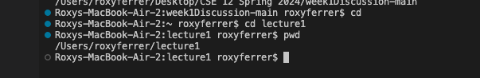

# Lab Report 1 
> Screenshot of commands for ```cd```


* the absolute path is 
```/User/roxyferrer/Desktop/CSE 12 Spring 2024/week1Discussion-main```
* i got this output because cd had no arguments, meaning it couldn't change the directory to any specified one. it returned nothing as an output.
* it is not an error, this is the usual output for when cd is passed with no arguments


* the absolute path is
```/Users/roxyferrer/lecture1```
* i got this output as we changed the directory to be ```lecture1``` compared to what it used to be
* the resulted output should be a result as it returns the new directory


* the absolute path is
```/Users/roxyferrer/lecture1```
* i got this output becuase we try changing the directory to a file
* this causes an error as the file cannot be the directory

Screenshots of commands for ```ls```


* the absolute path is
```/Users/roxyferrer/lecture1```
* i got this output as it is supposed to read the contents of ```lecture1```
* this is not an error, the command returns the contents


* the absolute path is
```/Users/roxyferrer/lecture1```
* i got this as i directed it to the directory of ```lecture1```. it is the same as the command with no arguments as the path was in ```lecture1```
* this is not an error as it returns the contents


* the absolute path is
```/Users/roxyferrer/lecture1```
* i got this as the ```ls``` command is now directed towards the file ```messages```
* this is not an error as it printed out the contents of ```messages```


Screenshot of commands for ```cat```
