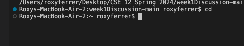

# Lab Report 1 
> Screenshot of commands for ```cd```


* the absolute path is 
```/User/roxyferrer/Desktop/CSE 12 Spring 2024/week1Discussion-main```
* i got this output because cd had no arguments, meaning it couldn't change the directory to any specified one. it returned nothing as an output.
* it is not an error, this is the usual output for when cd is passed with no arguments 


Screenshots of commands for ```ls```


Screenshot of commands for ```cat```
