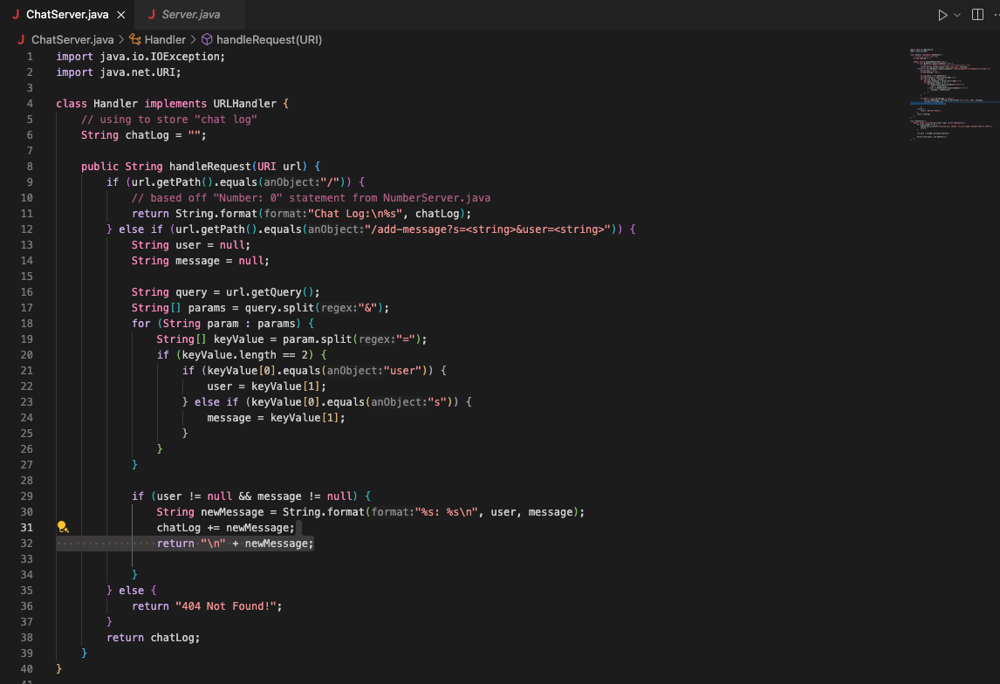
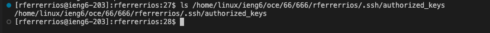

# Lab Report 2 
> Questions/Concerns: Couldn't figure out how to get server to run properly for part 1. Going to office hours this week to get help on this for resubmission.


## Part 1
Code for ```ChatServer```: 


Adding "Hello" onto Server:


* The method called for this command is the handle request. 
* The relevent arguments is in regards to what is being entered into the end of the url. In the example cases that we were given, there was a string that represented the user, and another string that returned the "chat". In terms of the fields, we get a new url containing ```/add-message?s=<string>&user=<string>``` which will alter which if-statement will be performed. Along with that, depending on what is passed as an arguement, the ```String``` which holds the previous chat logs will adjust accordingly. 
* The values that get changed are the ```Strings``` where the chats are stored. In this case, the string would hold "user1: Hello"


Adding "How are you" onto server 


* The method called for this command is also the handle request. As it is essentially taking the same thing as before, the same method can be used. 
* Like before, the same things are relevant as we update what the server has stored in the string. 
* The values that got added were the strings that were passed, along with the user that inputed them. The string would now hold
  "user1: Hello"
  "user2: How are you"

## Part 2
```ls``` for private key

 

```ls``` for public key 



Logging into account: 


## Part 3
From today's lab, I essentially got more comfortable working with ssh and logging into the school's server. I also learned a new command called ```scp``` which allows us to transfer files onto the server we have connected to our account. From lab2, I learned how to access this server. I'm glad we had more time to experiment on it so we could have a better idea on what exactly we can do on it. 
