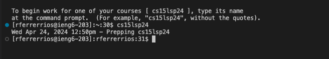

# Lab Report 2 
> Questions/Concerns: Couldn't figure out how to get server to run properly for part 1. Going to office hours this week to get help on this for resubmission.


## Part 1
Code for ```ChatServer```: 

Adding "Hello" onto Server:


* The method called for this command is
* Filler for question 2
* The values that get changed are 


Adding "How are you" onto server 


* The method called for this command is
* Filler question for 2
* The values that got added were 
## Part 2
```ls``` for private key

 

```ls``` for public key 


Logging into account: 



## Part 3
From today's lab, I essentially got more comfortable working with ssh and logging into the school's server. I also learned a new command called ```scp``` which allows us to transfer files onto the server we have connected to our account. From lab2, I learned how to access this server. I'm glad we had more time to experiment on it so we could have a better idea on what exactly we can do on it. 
