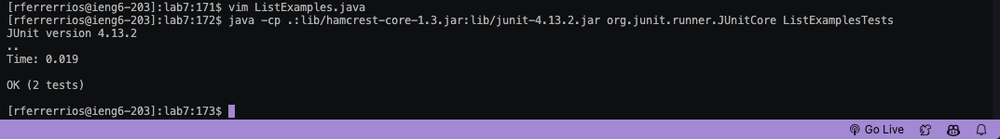

# Lab Report: Vim (Week 7)
* screenshot using ```vim```

  

Steps taken to do this:

**Step 4: Login** 
 * Typed in username: logged in using the ```ssh``` command

**Step 5: Clone**
 * copied ```git@github.com:roxannariios/lab7.git``` from lab steps
 *  Used ```git clone git@github.com:roxannariios/lab7.git``` ```<enter>``` to clone lab7 repository

**Step 6: Run tests**
 * Typed in ```javac -cp .:lib/hamcrest-core-1.3.jar:lib/junit-4.13.2.jar *.java``` ```<enter>``` to compile all files ending in ".java"
 * Typed in ```java -cp .:lib/hamcrest-core-1.3.jar:lib/junit-4.13.2.jar org.junit.runner.JUnitCore ListExamplesTests``` ```<enter>``` to run the specified test file

**Step 7: Edit test**
* Opened test file using ```vim ListExamples.java``` ```<enter>```
* Entered: ```<up><up><up><up><up><up>``` ```<right><right><right><right><right>``` ```<e>``` ```<r>``` ```2``` ```:wq```

**Step 8: Run Tests**
* Entered: ```<up><up><up><up>``` ```enter``` to run ```javac -cp .:lib/hamcrest-core-1.3.jar:lib/junit-4.13.2.jar *.java```
* Entered: ```<up><up><up><up>``` ```enter``` to run ```java -cp .:lib/hamcrest-core-1.3.jar:lib/junit-4.13.2.jar org.junit.runner.JUnitCore ListExamplesTests```

**Step 9: Commit and Push** 
* Entered: ```git add.``` ```<enter>``` ```git commit -m "Finished for lab report 4"``` ```<enter>``` ```git push origin main``` ```<enter>```


# Summary 

I think that this week was really interseting in terms of using ```vim```. At first I thought I wouldn't be a fan since I thought it was a little tedious to open files through the terminal but it proved to be pretty useful. I actually really liked doing it, since it just felt "cooler" if that makes sense. I will say that it does take a while to get used to, and learning/memorizing the commands proves to be pretty useful. For the commands that I used, I tried using an efficient way of getting to each section. For example, I used "e" in ```vim``` to get to the end of the word to save me the time of entering ```<right>``` more times than I needed to. I think that there are many ways to change the error in our file, it depends on what the user prefered. I used they key "r" since I could easily replace the "1" for "2". Another way of changing that would've been using "i" and deleting the "1" and inserting "2". This is also a good way, but I thought using r would help me rely more on the commands rather than only using "i". Both ways are good in my opinion.

All in all, I ran through a few issues which took me some time to resolve but helped me get a better understanding how to use git commands and vim commands. I think that making these mistakes will help me learn how to manuvere any issues that can arrise in the future. 
