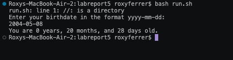
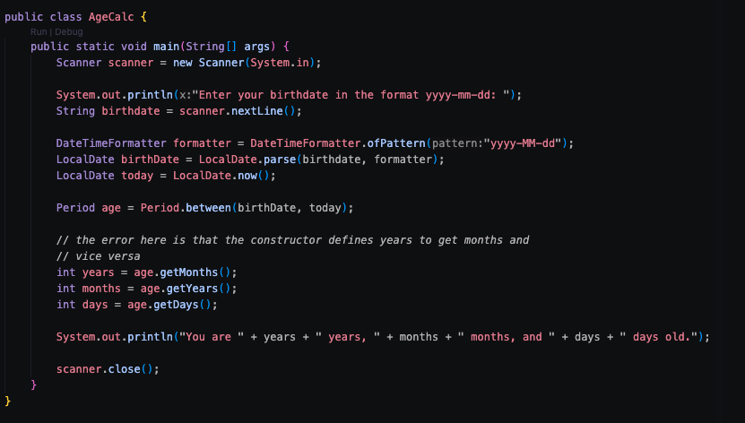
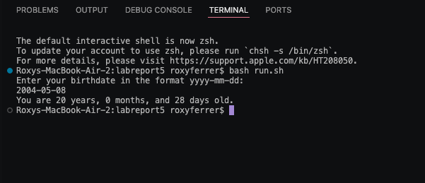
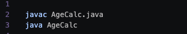

# Lab Report 5

**Part 1: Debugging Scenario**

*Piazza Post from student:*

Hello, 
I was wondering if I could get some help on my code?
I keep getting weird numbers for my code instead of the proper day.
In the years section, it keeps appearing as 0. 
Here is the screenshot of what I ran: 



Thank you in advance for the help!

*Piazza Response from TA:*

Hi, 
Looking at your output from running the program, I would recommend to look over how you're declaring your variables. Make sure that each matches the what you're declaring.
Feel free to come to office hours if you need any more help, or simply want me to look over your code.

*Bugs in code:*

In the first attempt, the student tries running the code with their constructor being wrong. They declared the wrong terms which caused the miscalculation as an output. 


After fixing the code, this is what the output should be with the given input:



*Information needed for setup*

Files and Directory:
```
|--AgeCalc
|     |----AgeCalc.java
|     |----run.sh
```
*Contents of each file before fixing*



*Commands ran to trigger bug:*

In open terminal: 

```bash run.sh```

*To fix bug*

To fix the bug, I went back and made sure that the constructors variables matched what they were trying to declare. 

**Part 2: Reflection**

Going back from what we learned in the second half of the quarter, it was interesting to see how all of the skills we learned built off of each other. 
I think that the thing that stuck with me the most was using ```vim``` and being able to edit files in the terminals. I know that this is a silly way to think of it, but 
it reminded me of how hackers were portrayed in movies. With the way it looked in the terminal, it was cool to access the files without having to really use VS Code. I think 
that it could be really useful when we aren't allowed to use VS Code, or when we are unfamiliar with the software we are using. 


